title: A Curriculum of Current Phonetic Shorthand
date: 2020-04-05
status: post

Henry Sweet's [Current Shorthand][current][^1] is a historical curiosity
twice over: once because very few people today need to learn shorthand
at all or even know what it is; twice because as shorthands go, it's
completely obscure. I learned about it because the surprisingly active
and enjoyable [Shorthand Subreddit][subreddit] is populated by people who
seem to really enjoy spelunking in digital archives for self-published
books from the late 19th century, the heyday of shorthand, when there
was actual money in designing and publicising a shorthand system of
one's own.

[current]: https://en.wikipedia.org/wiki/Current_Shorthand
[subreddit]: https://www.reddit.com/r/shorthand/

[^1]: Current comprises two separate but simpilar systems: *Orthographic*,
which represents spelling; and *Phonetic*, which represents sound. I
think that he imagined a practitioner would learn both. I haven't, and I
don't think you need to either. I learned Phonetic; an interested reader
can probably choose either one.

Nevertheless, insofar as one is already interested in learning a
shorthand[^2], it's quite worth taking a look at. I think it has a
combination of qualities that make it very recommendable:

- it is *efficient*, compressing quite a bit of writing into a small
  number of strokes;
- it is (relatively) *cursive*, visually and mechanically resembling
  longhand writing more than simple ellipses or geometrical shapes;
- by means of the second fact, it is, visually, fairly resistent to
  ambiguity [(I've talked about this before)][ambiguity].

[ambiguity]: https://blog.zdsmith.com/posts/three-shorthands.html
[^2]: I will assume in this article that the reader has already passed that threshold.

It's also got some marks against it. In addition to being very complex
(or at least involved, or at least *deep*), it is doubly inaccessible:
once because the only extant text that I know about is a [scanned PDF
of Sweet's own handwritten (!) manual from 1892][scan], and twice due
to the fact that the manual is, frankly, not well-laid out.

[scan]: https://cdm15457.contentdm.oclc.org/digital/collection/p15457coll1/id/105

Part of it is that Sweet was a phonetician before phonetics was a thing;
his vocabulary around different sounds is not the same as we would
use. More difficult is that the signs are actually quite systematic
but Sweet often *leaves the system implicit*; there are a few places
that his choice of symbol names in fact obscures their relationships to
other symbols.

I'd like to try to lay out some of the same information contained in the
manual in a more systematic and searchable way. Let's see if it works out.

# Some preliminary remarks

Like other phonetic shorthands, the basic principle of Current is
to represent spoken or written language with a sequence of written
symbols. The symbols are more numerous, and each one simpler, than the
letters of the alphabet, so that more can be written, more quickly,
than if you spelled the equivalent language out. The symbols making
up a single word (or sometimes group of words) are written together,
without taking the pen off the page (as in cursive writing), as that
speeds things up as well.

Generally speaking, especially at first, Current can be approached
word-by-word. And since we're dealing with the *phonetic* variant,
the outline for a word can be the symbols for all of its sounds written
together.

Finally, to write more quickly, a number of other techniques will be used. These include:

- leaving out certain sounds;
- using distinct symbols for common sequences of more than one sound;
- using distinct symbols for common words.

We'll start with the most basic part of the symbol inventory: the symbols
that make up the basic sounds of spoken English[^RP]. Anyone who knows them all
will be able write (and read back) any English whatsoever; everything that
comes afterwards will simply make the process of writing more efficient.

[^RP]: It's at this point that an uncomfortable truth must be outed:
Sweet was English, spoke in Received Pronunciation, and designed his
system to reflect that fact. This is particularly pertinent when it comes
to the vowels: in RP British English, of course, "r" after a vowel is
usually not pronounced as a consonant. Sometimes it is omitted entirely;
sometimes it lengthens a preceding /a/ into PALM vowel; sometimes it's
realized as a schwa.

    Current reflects this fact and, frankly, is at its best from a
    phonetic perspective when the phonetics in question are RP rather than
    American. As an example: it's quite awkward indeed to write an /r/
    sound after most vowels. It's easier by far to write out how it would
    sound in your best British accent. In practice, this becomes quite
    natural.

The basic sounds can, of course, be divided into consonants and vowels.

# Consonants

Consonants, generally, are represented by full-letter-sized symbols.

## Heights

Full symbols have four heights:

- *short*, as in the height of a lower-case `x`;
- *high*, as in the height of a lower-case `l` or upper-case `I`;
- *low*, as in the height of a lower-case `y`;
- *tall*, which extends from the top of an `l` to the bottom of a `y`.[^tall]

## Stroke Consonants

The atom of current shorthand is the *[connected vertical
downstroke][minim]*. Because Current mimics normal handwriting, it's
pretty tolerant of different degrees of slant, so "vertical" here is a
relative rather than absolute term.

A vertical stroke is connected by the upward stroke that leads into it
and the upward stroke that leads from it. There are two ways to connect
into those strokes: with a curve, and with a sharp angle.

\\[2 \text{ points of connection} × 2 \text{ ways to connect} = 4 \text{ styles of stroke:}\\]

|                          |starting from an angle                      |starting from a curve|
|---------                 |----------------------                      |---------------------|
|**leading into an angle** |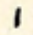     |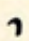|
|**leading into a curve**  |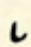|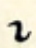 |

[minim]: https://en.wikipedia.org/wiki/Minim_(palaeography)
[^tall]: *tall* is a bad name, unnecessarily confusable with
*high*. *Full* would be more appropriate.

Constructing a matrix of heights and styles gives us the most basic strokes.

\\[4 \text{ styles of stroke} × 4 \text{ heights} = 16 \text{ strokes:}\\]

|             |stroke                                      |curve-stroke                                      |stroke-curve                                       |curve-stroke-curve                                |
|---------    |--------------------------------------------|--------------------------------------------------|-------------------------------------------------- |--------------------------------------------------|
|**short**    | *t* | *d* | *n*  | *r*        |
|**high**     |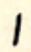 *p*  |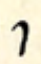 *b*  |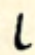 *m*   |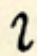 *kw* |
|**low**      |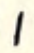 *k*   |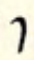 *g*   |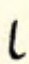 *ng*   |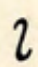 *ly*  |
|**tall**     |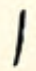 *tsh*|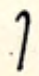 *dzh*|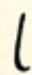 *ny* |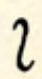 *ry* |

Arranged thus it's hopefully evident that there's an order to what sign
goes with what sound. Sweet is particularly hot on the correspondence
between where *in the mouth* a sound is articulated and where it's placed,
vertically, on the page (the man was a phonetician), which I think is
less helpful; however, especially in the upper-left of the matrix,
it hangs together ok.

The basic strokes stand for *unvoiced* sounds, and the curve-strokes
stand for their *voiced* counterparts. It's hopefully useful and intuitive
that /t/ goes with /d/, /k/ with /g/, and so forth.

Similarly, /tsh/ (usually written "ch", like "cheer" and "cheek") and
/dzh/ (one of the sounds made by "g" or "j", as in "George") go together.

The third column is the *nasals*; in English there isn't a voiced/unvoiced
distinction for them.

The fourth column hangs together less cleanly. A short
*curve-stroke-curve* stands for /r/, which is obviously very common
in English; the rest of the column is left over for certain consonants
followed by glide vowels.

## Loop Consonants

The second basic element of the vocabulary is the *loop*, which as a
term is hopefully self-explanatory.

Loops can have the same heights as strokes; however, there are only *two* types of loop:

- *regular*, where the pen starts from the bottom-left, forms a loop,
  and continues to the bottom-right: 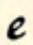
- *inverted*, where the pen starts from the upper-left,
  forms a loop downwards, and continues to the upper-right:
  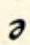

\\[2 \text{ styles of loop} × 4 \text{ heights} = 8 \text{ loops:}\\]

|             |loop                                      |inverted loop                                      |
|---------    |------------------------------------------|-------------------------------------------------- |
|**short**    | *s* | *z* |
|**high**     |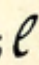 *f*  |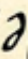 *v*  |
|**low**      |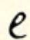 *zh*  |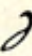 *sh*  |
|**tall**     |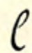 *nzh*|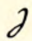 *nsh*|

The loops are used for what Sweet calls *hiss* sounds but what we'd call
*fricatives*, and mostly *sibilants*. The voiced/unvoiced relationship
of orientation is in place, which is very helpful.

Less helpful is the fact that it *swaps* midway through. In the first
two rows, the left side is unvoiced and the right side is voiced. In
the bottom two, we swap over. Sweet's rationale for this is that /sh/
is more common, and that the low inverted loop is easier to write. I'm
sure he's right, but I don't know if it's worth the added cognitive load.

The tall loops are left for blends involving /n/ + /the sound made by their
low counterparts/. These are more useful than they seem at first glance,
since in practice /nsh/ also works for /ntsh/ (as in "inch") and /nzh/
also works for /ndzh/ (as in "change").

## Rings

We've covered nearly all the consonants under the above two theories,
but there are a few stagglers that don't fit neatly.

The "canonical" form of /h/, so to speak, is an elongated low ring.

There are two sounds, voiced /th/ and unvoiced /dh/, represented by
"th". They are both short.

|             |ring                                       |half ring                                          |
|---------    |------------------------------------------ |-------------------------------------------------- |
|**short**    |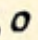 *th* |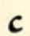 *dh*    |
|**low**      |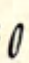 *h*    |                                                   |

It's important to note, however, that /h/ is much more commonly written
as a long diagonal stroke beginning below the line of writing, like so:
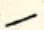

## Semivowels

The semivowels (or glides) are both written with what Sweet calls the
"flat curve": 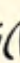

|             |flat curve                                     |
|---------    |------------------------------------------     |
|**high**     |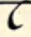 *w* |
|**low**      | *y*  |

As we've already seen, though, there are some blends with /w/ and /y/
that are useful to know as these symbols are a bit awkward to write in
the middle of a word.

## Wave

The final consonant to cover is /l/, which is written with a "wave", or what
we might now call a *tilde*: 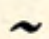. It's hard
to classify it by height, though I suppose technically it's *short*. But
in reality it's the only consonant whose overall height is less than
that of an `x`.

One result of this is that it can be comfortably written *on the line*
or at around `x` height. The former generally is used when /l/ is not
preceded by a vowel, while the latter is generally used when it is.

# Vowels

The vowels of Current are... numerous. The principle of their general
use is the same as most other phonetic shorthands: in writing, leave
them out whenever possible. A word written like `fnctshn` or `flm`
is often completely intelligible, especially written in context.

This principle is particularly important in light of one of Sweet's
basic principles of writing vowels: "medially, all weak vowels are
expressed by the stroke." That is, the short upward connecting stroke
between two consonants should be the standard way of representing an
unstressed vowel in the middle of a word.

This is perfectly sensible and more-or-less the default, as I say;
however, some of the more finicky elements of the shorthand arise when
Sweet tries to ensure that principle's inverse: the *presence* of a short,
connecting stroke should imply the presence of an unstressed vowel in
the middle of a word. I say good luck: in order to make your outlines
intelligible, you'll sometimes have to have *some* space between two
consonants even if there's no vowel between them. Don't sweat it.

This is an area where there won't be a very satisfactory way of
representing the sounds: Sweet's notation for vowels is pretty
straightforward but archaic; but then again, it's not very practical to
require the interested reader to know IPA as well. I'm going to try to
represent them with words that obviously demonstrate them, after [John C. Wells][lexical-sets].

[lexical-sets]: https://en.wikipedia.org/wiki/English_phonology

## Positions

While consonants are some kind of letter-form of at least `x` height,
vowels are generally smaller: roughly half `x`-height. Ordinarily,
all vowels live within the `x` space, and therefore have two positions:

- "low-mid", which sits at the baseline of writing: 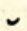;
- "high-mid", which sits at the top of the `x`: 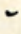.

## Hooks

The most basic form of vowel sign is the *hook*, which is just a single
horizontal curve: .

Hooks have two *orientations*:

- up, with the two ends of the curve pointing up: 
- down, with the two ends of the curve pointing down: 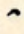

Hooks have two *lengths*:

- short, about half the width of an `x`: 
- long, about the full width of an `x` (or longer, as is useful): 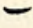

Generally speaking, the long versions of the symbols are the "longer"
of the pair.

\\[2 \text{ positions} × 2 \text{ orientations} × 2 \text{ lengths} = 8 \text{ hooks:}\\]

### low-mid hooks

|          |hook                                            |long hook                                          |
|--------- |------------------------------------------      |-------------------------------------------------- |
|**up**    | *PRICE*[^schwaable]  |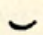 *PALM*   |
|**down**  |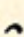 *TRAP* |                                                   |

[^schwaable]: Any of these vowels can have a small up-loop
added after them, without any ambiguity, to indicate that vowel followed
by a schwa. This, along with the special double-down-hook forms for the
/u/ vowels, provides a way to follow every possible vowel by a schwa.

    The utility of this is a little more obvious in light of the fact that the
    phonetics in question is British Received Pronunciation. In nearly every
    occasion that one would follow a vowel by an "r"---examples Sweet gives
    include "carrier", "career", shower", "follower"---it would be realized
    in pronunciation as a schwa.

### high-mid hooks

|          |hook                                              |long hook                                          |
|--------- |------------------------------------------        |-------------------------------------------------- |
|**up**    | *KIT*[^schwaable]     | *FLEECE*[^schwaable]    |
|**down**  | *DRESS*[^rare] |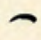 *FACE*[^rare]  |

## Double Hooks

Double hooks can vary along all the same dimensions as single hooks;
they just consist of two curves written together.

\\[2 \text{ positions} × 2 \text{ orientations} × 2 \text{ lengths} = 8 \text{ double hooks:}\\]

### low-mid double hooks

|          |double                                         |long double                                          |
|--------- |------------------------------------------   |-------------------------------------------------- |
|**up**    |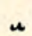 *FOOT*  |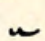 *GOOSE* |
|**down**  |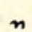 *POOR* | |

### high-mid double hooks

|          |double hook                                   |long double hook                                     |
|--------- |------------------------------------------    |-------------------------------------------------- |
|**up**    |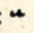 ***UN**ITE*   |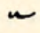 *USE* |
|**down**  |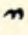 *FUEL* | |

Both the *down* and the *high-mid* versions deserve a little explanation:

- *double down-hooks* represent the same sound as their up-hook counterparts, but with a schwa /ə/ at the end.[^RP2]
- *high-mid double hooks* represent a /u/ sound, just like the low-mid ones, but with a /y/ in front.

## Vowel loops

The next class of vowel symbol is the *(little) loop*. It's about the
size of an up- or down-hook; however, instead of a horizontal curve it's
a completed circle.

Just as with their full-size consontantal counterparts, loops can be
*regular* or *inverted*. To help distinguish them from the bigger versions we will say:

- *up*, where the pen starts from the bottom-left, forms a loop,
  and continues to the bottom-right: 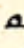
- *down*, where the pen starts from the upper-left,
  forms a loop downwards, and continues to the upper-right:
  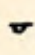

If a loop is the first symbol in an outline, we need to be able to
distinguish *up* from *down* since obviously there will be no connecting
stroke to connect from. Therefore up loops are
not closed if they're the first part of any outline:
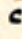. This principle will
hold for any of the up-loop variants.

\\[2 \text{ positions} × 2 \text{ orientations} × 2 \text{ lengths} = 8 \text{ loops:}\\]

### low-mid loops

|          |loop                                            |long loop                                          |
|------- |------------------------------------------      |-------------------------------------------------- |
|**up**  |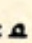 *MOUTH*[^schwaable] |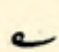 *GOAT*[^schwaable]   |
|**down**|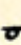 *STRUT*| *SQUARE* |

### high-mid loops

|          |loop                                              |long loop                                          |
|--------- |------------------------------------------        |-------------------------------------------------- |
|**up**    | *CLOTH*[^schwaable]     | *THOUGHT*[^schwaable]    |
|**down**  | ***A**ROUND*[^rare] | *NURSE*  |

[^rare]: The DRESS, FACE, and schwa vowels, in particular, are usually
not necessary to write out with their full canonical symbols. The DRESS
and schwa vowels can usually be written with the *short stroke*, and the
*long stroke*, written from the baseline (as opposed from below it),
is a more convenient synonym for the FACE vowel. These symbols only
usually come into play when used in contractions or word signs.

[^RP2]: This, along with the [^schwaable] vowels, completes an inventory
of vowels followed by a schwa. This is, as previously noted, particularly
important in a phonetic system based on Received Pronunciation, where
segments that an American would pronounce as the r-colored vowel /ɚ/
or as a schwa followed by an r /ər/ would instead be pronounced as a
bare schwa /ə/.

# To come: Arbitraries, Consonant Groups, Rising Consonants, Finals, Implied Characters, Contraction, Word Omission, Limbs, Signs

The foregoing, insofar as curricula go, is demonstrably not much of a
curriculum at all. For one thing, there are no samples of full outlines
at all. This document is at very best a supplement to Sweet's original
manual. Hopefully it presents a more *systematic* introduction to the core
elements, which are themselves the most systematic of the overall theory.

Needless to say, there are many elements in the latter part of the section
that are arranged systematically and demonstrate productive principles
(rather than just being bags of arbitrarily drawn words). In time I hope
to get those together too.
